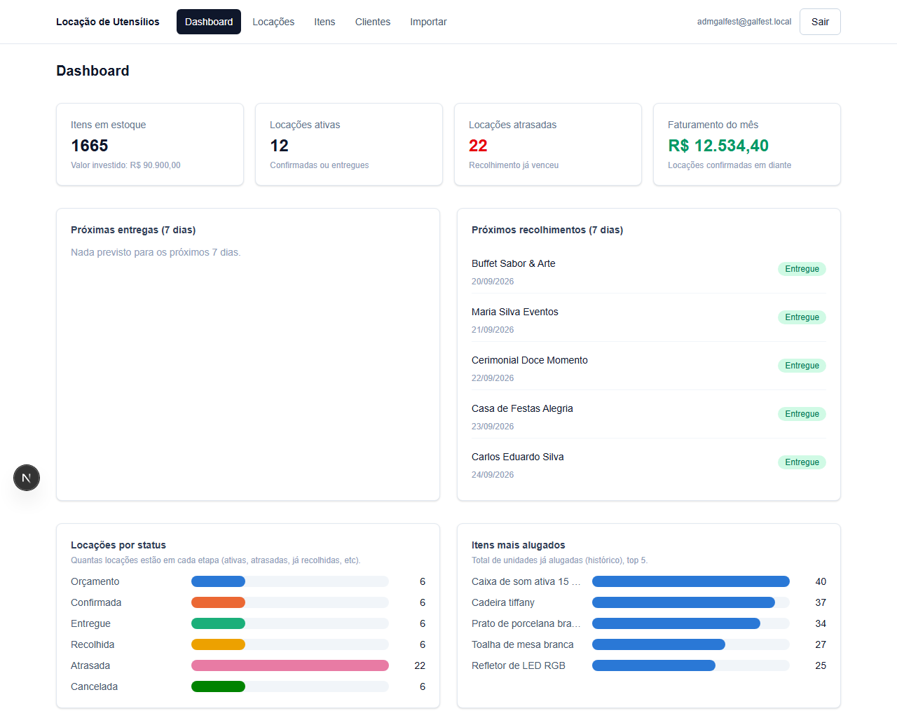

# Sistema de Controle de Locação de Utensílios para Eventos

Sistema web para uma empresa de locação de utensílios (mesas, cadeiras,
louças, decoração, som e iluminação) controlar **estoque**, **clientes** e
**locações** em um só lugar, substituindo planilhas soltas.

**Site:** https://controle-locacao-galfest.vercel.app *(acesso restrito por login)*

## Como foi construído

- **Next.js + TypeScript** — framework web moderno, roda tanto a tela quanto
  o backend no mesmo projeto.
- **Supabase** — banco de dados (Postgres) e sistema de login prontos, na
  nuvem, sem precisar instalar nada em nenhum computador.
- **Vercel** — hospedagem do site, com deploy automático a cada atualização
  do código.
- **Tudo 100% em nuvem**: código no GitHub, banco no Supabase, site na
  Vercel — dá pra atualizar de qualquer lugar.

## Como funciona

**1. Login restrito** — só entra quem tem usuário e senha. Não existe
cadastro público; o acesso é criado manualmente pelo administrador.

**2. Itens** — cadastro de cada utensílio com categoria, quantidade em
estoque, preço da diária e custo de aquisição. O sistema calcula sozinho
quanto de cada item está **disponível** em um período, considerando as
locações já marcadas.

**3. Clientes** — cadastro de quem aluga (pessoa física, buffet,
cerimonialista, casa de festas etc.), com endereço e telefone.

**4. Locações** — o coração do sistema: vincula um cliente a uma lista de
itens, com datas de entrega e recolhimento, status (Orçamento, Confirmada,
Entregue, Recolhida, Atrasada, Cancelada) e frete. O valor total é
calculado automaticamente (item × quantidade × diárias + frete), e o
sistema avisa se algum item não tem estoque suficiente naquele período.

**5. Importação por planilha** — em vez de cadastrar um por um, dá pra
subir uma planilha Excel/CSV com vários itens, clientes ou locações de
uma vez. O sistema confere linha por linha e mostra o que deu certo e o
que precisa corrigir.

**6. Dashboard** — visão geral com estoque total, valor investido,
locações ativas, locações atrasadas, faturamento do mês, próximas
entregas/recolhimentos e dois gráficos: quantas locações estão em cada
status, e quais itens são mais alugados.

## Segurança

- Sem cadastro público — o único jeito de entrar é com a senha que o
  administrador definiu.
- Cada tabela do banco tem uma regra de segurança própria: mesmo que
  alguém descubra o endereço do site, sem login não consegue ver nem
  alterar nenhum dado.
- Senhas nunca ficam guardadas em texto puro — isso é feito pelo próprio
  serviço de login (Supabase Auth).
